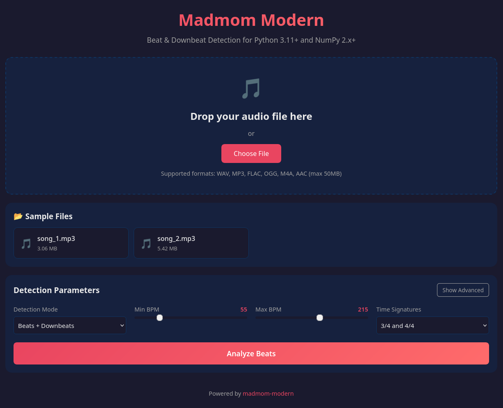
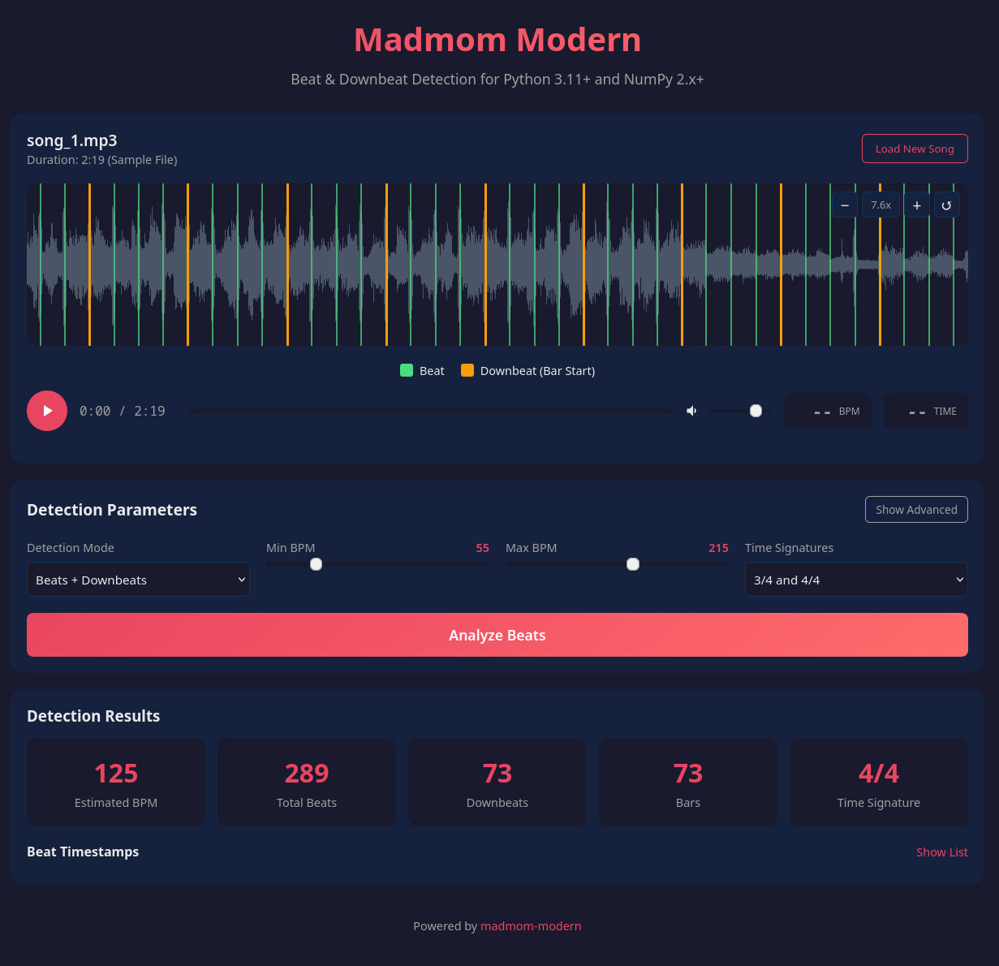

# madmom-modern

A modernized fork of the [madmom](https://github.com/CPJKU/madmom) audio signal processing library, updated for **Python 3.11+** and **NumPy 2.x+**.

## About

madmom is an audio signal processing library written in Python with a strong focus on music information retrieval (MIR) tasks. This modernized version maintains full compatibility with the original madmom API while ensuring compatibility with current Python and NumPy versions.

### Key Features

- Beat and downbeat detection using recurrent neural networks
- Onset detection with multiple algorithms
- Tempo estimation
- Chord recognition
- Note transcription
- Pre-trained models included

## Changes from Original madmom

This fork includes the following modernization updates:

- **Python 3.12+ compatibility**: Removed `distutils` dependency (removed in Python 3.12)
- **NumPy 2.x+ compatibility**:
  - Replaced deprecated NumPy type aliases (`np.float` -> `np.float64`, `np.int` -> `np.int64`, `np.bool` -> `np.bool_`)
  - Fixed inhomogeneous array creation in HMM decoding
  - Migrated model files to NumPy 2.x pickle format (eliminates deprecation warnings)
- **collections.abc imports**: Migrated abstract base class imports from `collections` to `collections.abc`
- **Modern build system**: Added `pyproject.toml` for PEP 517/518 compliance
- **Updated Cython**: Compatible with Cython 3.x
- **Updated dependencies**: Uses latest secure versions of NumPy, SciPy, and other dependencies
- **Secure model loading**: SHA256 hash verification and restricted unpickling for pickle files

### Model Migration

The pre-trained model files have been migrated to NumPy 2.x format. If you need to migrate models from an older installation:

```bash
python scripts/migrate_models.py
```

Note: The TCN (Temporal Convolutional Network) beat models (`beats/2019/`) are not yet supported as the `TCNLayer` implementation is pending.

## Security

The pre-trained models use Python pickle (`.pkl`) files, which can execute arbitrary code when loaded. This is a known security risk in ML/AI.

**All 92 bundled models have been security scanned:**
- Scanned with [Fickling](https://github.com/trailofbits/fickling) (Trail of Bits) and byte-level pattern matching
- No dangerous imports found (no `os`, `subprocess`, `socket`, `eval`, etc.)
- Only legitimate imports: `numpy`, `scipy.sparse`, `madmom.ml.nn.*`
- Full scan results in `madmom/models/security_scan_results.json`

**madmom-modern mitigates pickle risks with:**
- SHA256 hash verification of all bundled models (`model_manifest.json`)
- Restricted unpickler that only allows known-safe classes
- Module allowlisting to prevent dangerous imports

```python
from madmom.models import secure_load, ModelIntegrityError

# Safely load a model with hash verification
try:
    model = secure_load("/path/to/model.pkl")
except ModelIntegrityError:
    print("Model file may have been tampered with!")
```

See [SECURITY.md](SECURITY.md) for detailed security information and best practices.

## Installation

### From Source

```bash
git clone https://github.com/imcmurray/madmom-modern.git
cd madmom-modern

# Create and activate a virtual environment (recommended)
python -m venv venv
source venv/bin/activate  # On Windows: venv\Scripts\activate

pip install .
```

### Development Installation

```bash
# Create and activate a virtual environment
python -m venv venv
source venv/bin/activate  # On Windows: venv\Scripts\activate

pip install -e ".[dev]"
```

## Requirements

- Python >= 3.11
- NumPy >= 2.2
- SciPy >= 1.14
- Cython >= 3.0
- mido >= 1.3

## Quick Start

### Beat Detection

```python
import madmom

# Create a beat processor
proc = madmom.features.beats.RNNBeatProcessor()

# Process an audio file
activations = proc('audio_file.wav')

# Track beats using a DBN
dbn = madmom.features.beats.DBNBeatTrackingProcessor(fps=100)
beats = dbn(activations)

print(f"Detected beats at: {beats}")
```

### Downbeat Detection

```python
import madmom

# Create a downbeat processor
proc = madmom.features.downbeats.RNNDownBeatProcessor()

# Process an audio file
activations = proc('audio_file.wav')

# Track downbeats
dbn = madmom.features.downbeats.DBNDownBeatTrackingProcessor(
    beats_per_bar=[3, 4], fps=100
)
downbeats = dbn(activations)

print(f"Detected downbeats: {downbeats}")
```

### Onset Detection

```python
import madmom

# Create an onset processor
proc = madmom.features.onsets.RNNOnsetProcessor()

# Process an audio file
activations = proc('audio_file.wav')

# Peak picking to get onset times
onsets = madmom.features.onsets.OnsetPeakPickingProcessor(fps=100)(activations)

print(f"Detected onsets at: {onsets}")
```

## Web Interface — See It in Action

Most MIR libraries leave you staring at arrays of numbers. **madmom-modern ships with a built-in web app** so you can drag in any song and instantly *see* and *hear* the beat detection working in real time. No extra tooling, no Jupyter notebooks, no matplotlib boilerplate — just drop a file and go.

<p align="center">
  
</p>

<p align="center"><em>Drag-and-drop any audio file or pick from the included samples — supports WAV, MP3, FLAC, OGG, M4A, and AAC.</em></p>

<p align="center">
  
</p>

<p align="center"><em>Interactive waveform with color-coded beat (green) and downbeat (orange) markers, zoomable display, playback controls, and full detection results at a glance.</em></p>

**Why this matters:** Whether you're evaluating madmom for a project, teaching a class on MIR, or just curious what 125 BPM looks like overlaid on a waveform — the web interface gets you from zero to insight in seconds. Load your own music, tweak the BPM range and time signature, hit **Analyze Beats**, and watch the results appear. Click any beat marker to jump straight to that moment in the song.

### Running the Web App

```bash
# Set up and activate a virtual environment if you haven't already
python -m venv venv
source venv/bin/activate  # On Windows: venv\Scripts\activate

# Install madmom-modern
pip install -e .

# Install web dependencies and run
cd webapp
pip install -r requirements.txt
python app.py
```

Then open `http://localhost:5000` in your browser. Sample audio files are included so you can start exploring immediately.

### Web Interface Highlights

- **Drag-and-drop upload** — WAV, MP3, FLAC, OGG, M4A, AAC (up to 50 MB)
- **Interactive zoomable waveform** with color-coded beat and downbeat markers
- **Adjustable detection parameters** — BPM range, time signatures (3/4, 4/4, and more)
- **Click-to-seek** — click any beat marker to jump to that position in the song
- **Instant results dashboard** — estimated BPM, total beats, downbeats, bars, and detected time signature
- **Sample files included** — start experimenting right away, no audio files needed

See [webapp/README.md](webapp/README.md) for detailed documentation.

## Documentation

For detailed documentation, please refer to:
- [Original madmom documentation](https://madmom.readthedocs.io/)
- [Original madmom paper](https://arxiv.org/abs/1706.00074)

## License

This project is licensed under the BSD-3-Clause License. See [LICENSE](LICENSE) for details.

The pre-trained models are licensed under a Creative Commons Attribution-NonCommercial-ShareAlike 4.0 International License.

## Credits

The original madmom library was developed by the Department of Computational Perception at Johannes Kepler University Linz, Austria, and the Austrian Research Institute for Artificial Intelligence (OFAI), Vienna, Austria.

### Original Authors

- Sebastian Bock
- Filip Korzeniowski
- Jan Schluter
- Florian Krebs
- Gerhard Widmer

### Citation

If you use this library in academic work, please cite the original paper:

```bibtex
@inproceedings{madmom,
   title = {{madmom: a new Python Audio and Music Signal Processing Library}},
   author = {B{\"o}ck, Sebastian and Korzeniowski, Filip and Schl{\"u}ter, Jan and Krebs, Florian and Widmer, Gerhard},
   booktitle = {Proceedings of the 24th ACM International Conference on Multimedia},
   pages = {1174--1178},
   year = {2016},
   address = {Amsterdam, The Netherlands},
   doi = {10.1145/2964284.2973795}
}
```

## Contributing

Contributions are welcome! Please feel free to submit a Pull Request.
